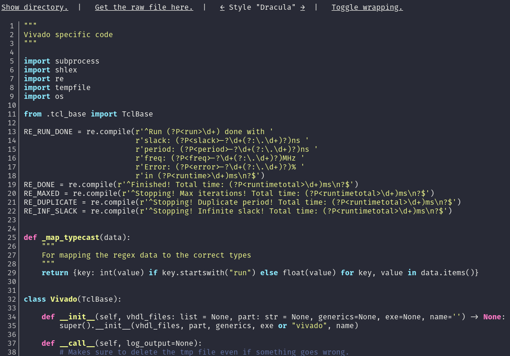

# Minimalist Source Code Viewer for Nginx

Copyright 2018 Dries007

Based on highlightjs, highlightjs-line-numbers.

Written in about a day because I wanted to display my code pretty for my Master Thesis.

When combined with some nginx configuration, all the clever bits happen client side.

Inspired by <https://stackoverflow.com/a/41532293>

Feel free to use under terms of MIT license, with link back to [this](https://github.com/dries007/NginxSourceViewer) repo.

There is a screenshot down below!

## Make it work

1. Edit the python file to include the languages & styles you want to use.
2. Run the python file.
3. Include the output file in an Nginx `server` block.
4. Magic!

## Screenshots

